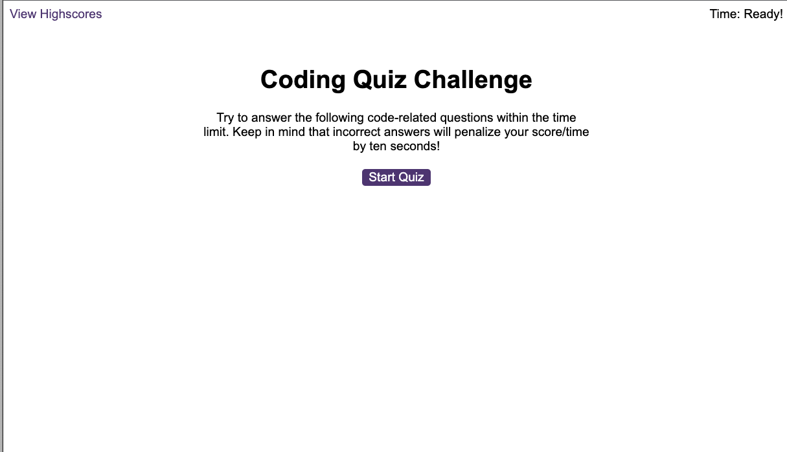
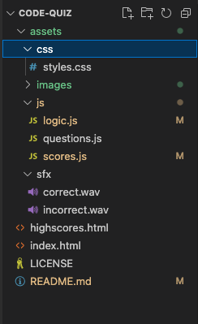

# Code-Quiz

## Description
This Code Quiz Project was created as part of the Bootcamp course with EDx. This Page contains coding quiz with multiple-choice questions where JavaScript dynamically updates the HTML and CSS code with a responsive user interface.
The user has 1 minute to answer 14 questions, with every correct answer the score is increased and with incorrect answers a 10 second penalty is deducted off  the remaining time. After completing the quiz, the user can input their initials and save their score to local storage that can be reviewed on a separate page, with the option to clear the local storage.

Please Note that the questions presented on this page have been adapted from w3schools Javascript test: that can be found: https://www.w3schools.com/quiztest/quiztest.asp?qtest=JS:

(all rights to the information provided in the questions remain property of w3schools)

https://tjhandson.github.io/Code-Quiz/

# Installation

## Web browser - Chrome
To View the finished webpage downloading a Web browser, such as google chrome, is recomended. Please find the link too download below: https://www.google.co.uk/chrome/?brand=YTUH&gclid=EAIaIQobChMI5pKQxIr2-wIVwp7tCh3CoA27EAAYASAAEgI4jfD_BwE&gclsrc=aw.ds

With the instalation process noted below: https://support.google.com/chrome/answer/95346?hl=en-GB&co=GENIE.Platform%3DDesktop

## Git
It is recomented to download Git if you are looking to interact with this public repo, Details on downloading this can be found here: https://github.com/git-guides/install-git

## VS Code
Visual Studio Code is a source-code editor (there are others available), The download for this cn be found on; https://code.visualstudio.com/download

# Usage
This is a public repo and available to be run on either a webrowser or locally.

## Run on Wb browser (Chrome recommented for acccess to Console)
Follow the link on: https://tjhandson.github.io/Code-Quiz/

To access the console in Chrome Browser use this keyboard shortcut: "Cmd + Option + J" (on a Mac) or "Ctrl +Shift +J" (on Windows).
However, alternatively right-click on the webpage and click "Inspect" to open the developer console and slecet the "Console" tab within this tab

## Run Locally

Clone project
git clone git@github.com:tjhandson/Code-Quiz.git

Once downloaded the follow assets should be available within this folder:

## Credits

All taught and Source material were provided by © 2022 edX Boot Camps LLC.

## License

MIT License 2022 Please refer to the LICENSE in the repo.

## Contributing

---

© 2022 edX Boot Camps LLC. Confidential and Proprietary. All Rights Reserved.
